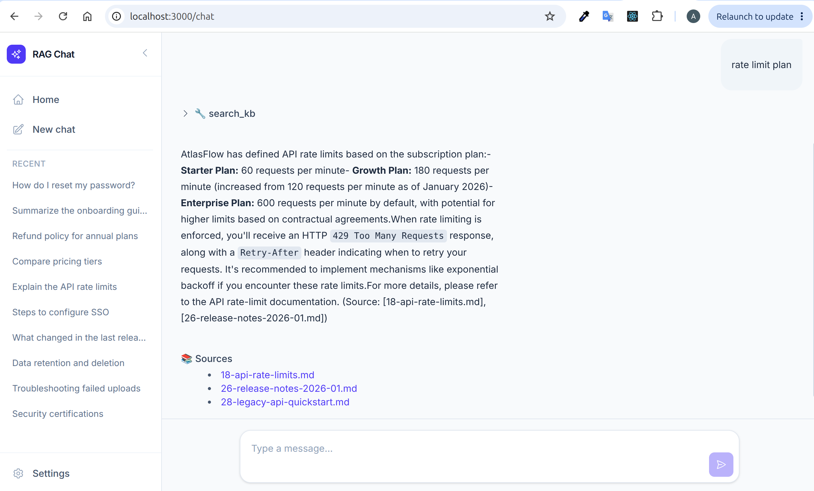

# RAG (Retrieval Augmented Generation)

[](pyproject.toml)
[](LICENSE)
[](https://github.com/hadifar/rag/actions/workflows/pre-commit.yml)

A ~~production~~ ready to use RAG implementation. Support chatbot over the AtlasFlow knowledge base ([data/](data/)), built on FastAPI + LangGraph + Pinecone, with a React frontend.

Architecture: [docs/engineering_design.md](docs/engineering_design.md).



## Quick start
```bash
git clone https://github.com/hadifar/rag.git
cd rag
bash scripts/setup.sh
# fill in .env (see .example.env), then:
docker compose up --build
```
Full setup (secrets, `.env`, Postgres password) and other ways to run it (bare `uv`, CLI,
frontend dev server) are in [docs/setup.md](docs/setup.md).

## Coding style
Follows PEP 20 and the [Google Python Style Guide](https://github.com/google/styleguide/blob/gh-pages/pyguide.md).

## Contribution
See [CONTRIBUTING.md](CONTRIBUTING.md).

## License
[LICENSE](LICENSE)
