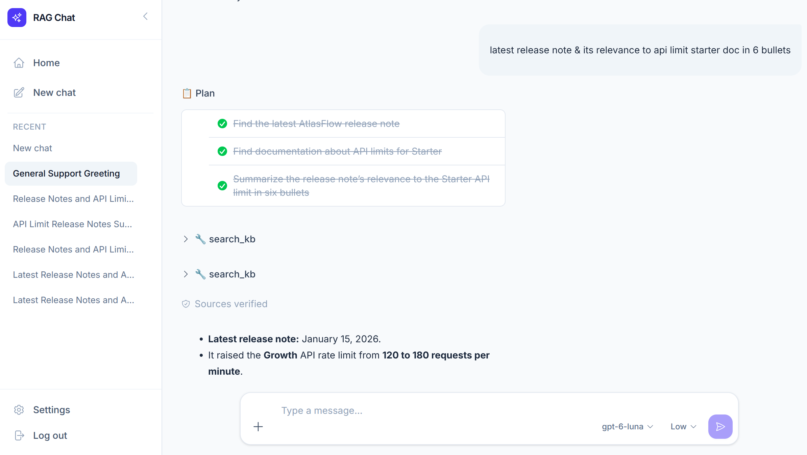

# RAG (Retrieval Augmented Generation)

[](pyproject.toml)
[](LICENSE)
[](https://github.com/hadifar/rag/actions/workflows/pre-commit.yml)

A ready to use RAG implementation! built on FastAPI + LangGraph + Postgress(pgvector), with a React frontend.




## Quick start
```bash
git clone https://github.com/hadifar/rag.git && cd rag && bash scripts/setup.sh
# fill in .env (see .example.env), then:
docker compose up --build
# once it's up, create a login (no public signup):
docker compose exec backend rag create-user you@example.com --admin
```
Then sign in at http://localhost:3000 and load the knowledge base: upload `data/data.zip` under
**Settings → Knowledge base**. See [Run the local stack](docs/how-to/infra/run-local-stack.md) for
details, or [Local development](docs/tutorials/local-development.md) to run without Docker.

## Docs
See [docs/README.md](docs/README.md) & [docs/](docs/)

## Contribution
See [CONTRIBUTING.md](CONTRIBUTING.md)

## License
[LICENSE](LICENSE)
