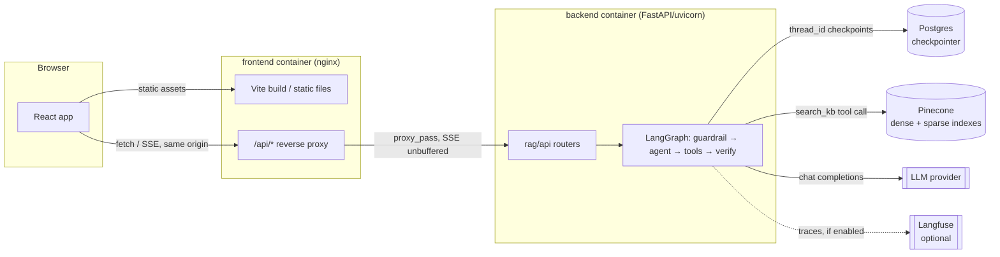
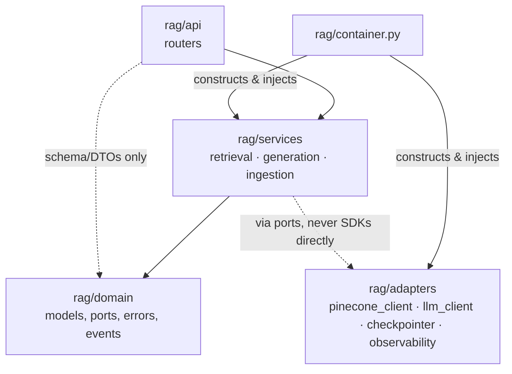
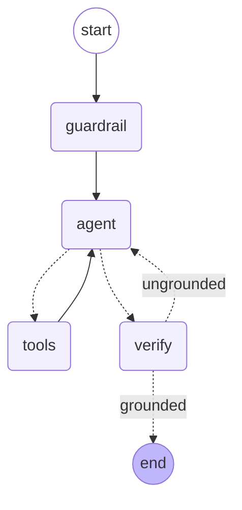
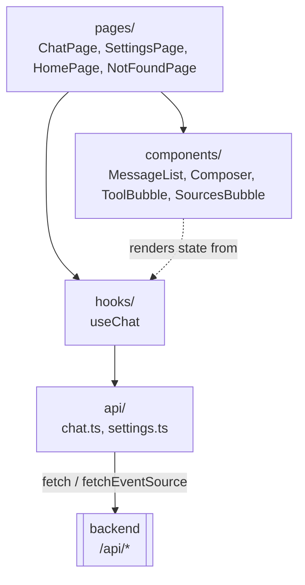
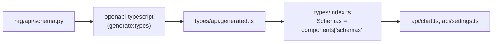

# Architecture

Diagram-first companion to [reference.md](reference.md) (what exists) and
[conventions.md](conventions.md) (how to extend it). This page focuses on how the backend and
frontend are shaped internally and how they talk to each other.

## System overview

The browser only ever sees one origin (e.g., `http://local:3000`) — it never knows the backend's hostname. nginx proxies
`/api/*` to `BACKEND_URL` (`infra/docker/nginx.conf.template`), and Vite's dev server proxies
the same path locally (`vite.config.ts`).

## Backend layering

Enforced by `import-linter` (see [enforcement.md](enforcement.md)), not just convention:

`rag.domain` is forbidden from importing `services`/`adapters`/`api`; `rag.services` and
`rag.api` are both forbidden from importing `rag.adapters` directly — they depend on
`domain`'s `Port` protocols, and `container.py` is the only place a concrete adapter gets
wired in.

## Generation graph (LangGraph)

`guardrail` classifies the message as in/out of scope for AtlasFlow (adding an off-topic
instruction rather than short-circuiting, so the decline text is still generated — and
streamed — by `agent`). `agent` calls the LLM (bound to `search_kb`); `tools_condition` routes
to `tools` on a tool call or on to `verify` otherwise. `tools` always loops back to `agent`.
`verify` checks the final answer against retrieved context (`is_grounded`) and either ends the
turn or sends `agent` back with a revision instruction, capped at `MAX_VERIFY_ATTEMPTS`.

## Frontend structure

Components stay presenter-only: `useChat` owns the streaming/state logic, `api/chat.ts` owns
the transport, `ToolBubble`/`MessageList` only render what the hook hands them.

## Backend schema → frontend types

A build-time connection, not a runtime one — `types/index.ts` re-exports the whole generated
schema map as `Schemas`, so `api/chat.ts` and `api/settings.ts` reference `Schemas['ChatRequest']`
/ `Schemas['SettingsResponse']` instead of hand-duplicating request/response shapes:

Kept in sync by the `frontend-api-types` pre-commit hook, not by hand — see
[enforcement.md](enforcement.md#backendfrontend-schema-sync).
