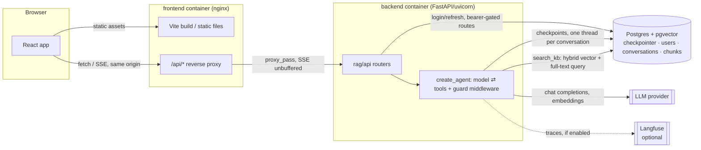
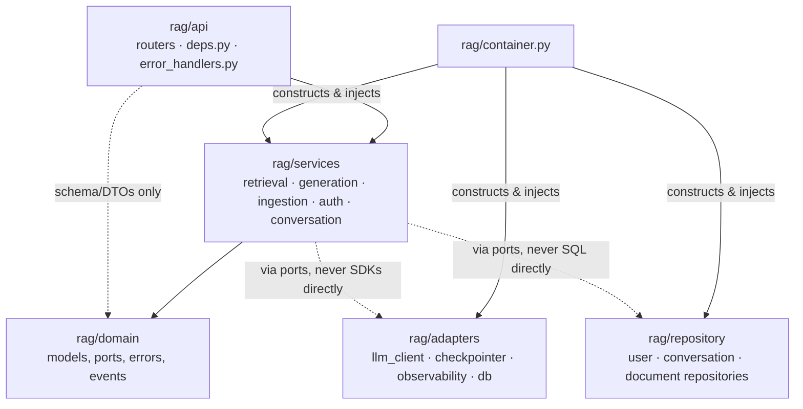
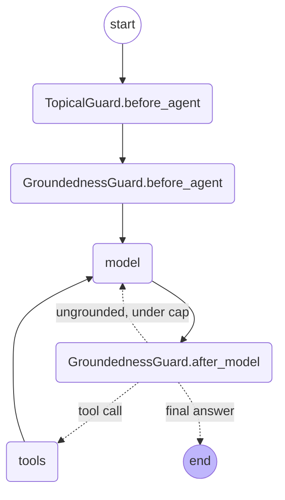
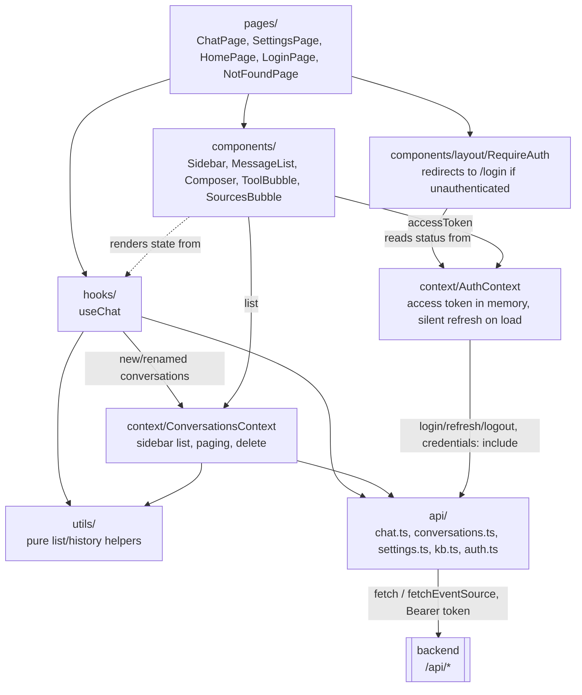
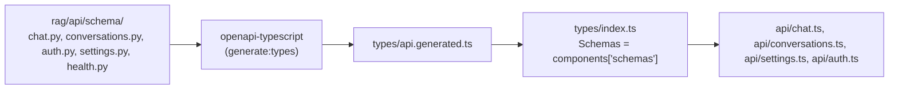

# Architecture

Diagram-first companion to [reference.md](reference.md) (what exists) and
[conventions.md](conventions.md) (how to extend it). This page focuses on how the backend and
frontend are shaped internally and how they talk to each other.

## System overview

```mermaid
graph LR
    subgraph browser[Browser]
        ui[React app]
    end

    subgraph frontendc["frontend container (nginx)"]
        static[Vite build / static files]
        proxy["/api/* reverse proxy"]
    end

    subgraph backendc["backend container (FastAPI/uvicorn)"]
        api[rag/api routers]
        langgraph["create_agent: model ⇄ tools + guard middleware"]
    end

    postgres[(Postgres + pgvector<br/>checkpointer · users · conversations · chunks)]
    llm[[LLM provider]]
    langfuse[[Langfuse<br/>optional]]

    ui -->|static assets| static
    ui -->|"fetch / SSE, same origin"| proxy
    proxy -->|"proxy_pass, SSE unbuffered"| api
    api -->|"login/refresh, bearer-gated routes"| postgres
    api --> langgraph
    langgraph -->|checkpoints, one thread per conversation| postgres
    langgraph -->|search_kb: hybrid vector + full-text query| postgres
    langgraph -->|chat completions, embeddings| llm
    langgraph -.->|traces, if enabled| langfuse
```

The browser only ever sees one origin (e.g., `http://local:3000`) — it never knows the backend's hostname. nginx proxies
`/api/*` to `BACKEND_URL` (`infra/docker/nginx.conf.template`), and Vite's dev server proxies
the same path locally (`vite.config.ts`). This matters for auth too: the refresh token is a
same-site cookie, which only works cleanly because the browser only ever talks to one origin —
there's no cross-origin cookie problem to solve.

## Backend layering

Enforced by `import-linter` (see [enforcement.md](enforcement.md)), not just convention:

```mermaid
graph TD
    api[rag/api<br/>routers · deps.py · error_handlers.py]
    services[rag/services<br/>retrieval · generation · ingestion · auth · conversation]
    domain[rag/domain<br/>models, ports, errors, events]
    adapters[rag/adapters<br/>llm_client · checkpointer · observability · db]
    repository[rag/repository<br/>user · conversation · document repositories]
    container[rag/container.py<br/>]

    api --> services
    services --> domain
    api -.->|schema/DTOs only| domain
    container -->|constructs & injects| adapters
    container -->|constructs & injects| repository
    container -->|constructs & injects| services
    services -.->|via ports, never SDKs directly| adapters
    services -.->|via ports, never SQL directly| repository
```

`rag.domain` is forbidden from importing `services`/`adapters`/`repository`/`api`; `rag.services`
and `rag.api` are both forbidden from importing `rag.adapters` or `rag.repository` directly —
they depend on `domain`'s `Port` protocols, and `container.py` is the only place a concrete
adapter or repository gets wired in. `rag.repository` exists alongside `rag.adapters` rather than
merged into it — same composition-root-only rule, just a distinct kind of infra (hand-written SQL
over a domain port, vs. a wrapped third-party SDK client) — see
[conventions.md](conventions.md#adding-a-new-repository-persistence-behind-a-domain-port).

## Generation graph (`create_agent`)

`generation_service/graph.py` builds the graph with LangChain's `create_agent` (a model ⇄ tools
loop); the guards are middleware around it rather than hand-wired nodes:

```mermaid
graph TD
    __start__((start)) --> topical(TopicalGuard.before_agent)
    topical --> resetg(GroundednessGuard.before_agent)
    resetg --> model(model)
    model --> verify(GroundednessGuard.after_model)
    verify -.->|tool call| tools(tools)
    verify -.->|ungrounded, under cap| model
    verify -.->|final answer| __end__((end))
    tools --> model

    classDef default fill:#f2f0ff,line-height:1.2
    classDef first fill-opacity:0
    classDef last fill:#bfb6fc
    class __start__ first
    class __end__ last
```

- **`TopicalGuard`** classifies the user's message once per turn (`before_agent`). For an
  off-topic message it adds the decline instruction to the system prompt and removes the tools
  — for that turn's model calls only (`wrap_model_call`), so the decline text is still generated
  and streamed by `model`.
- **`GroundednessGuard`** resets its revision counter each turn (`before_agent`), checks each
  final answer against **this turn's** `search_kb` results (`after_model`), and on an ungrounded
  one jumps back to `model` with a revision instruction, capped at `MAX_VERIFY_ATTEMPTS`.
- **`ModelRetryMiddleware`** retries the model call, then ends the turn with a fixed apology.

Guard instructions are never saved to the thread: the checkpoint holds only what the user and
the assistant said, so nothing carries over into later turns. "This turn" is everything after
the latest `HumanMessage` (`generation_service/turn.py`); `search_kb` returns its source ids as
the `ToolMessage` artifact, and the `sources` event is built from this turn's artifacts.

## Frontend structure

```mermaid
graph TD
    pages["pages/<br/>ChatPage, SettingsPage, HomePage, LoginPage, NotFoundPage"]
    guard["components/layout/RequireAuth<br/>redirects to /login if unauthenticated"]
    authctx["context/AuthContext<br/>access token in memory, silent refresh on load"]
    convctx["context/ConversationsContext<br/>sidebar list, paging, delete"]
    hooks["hooks/<br/>useChat"]
    utils["utils/<br/>pure list/history helpers"]
    apiclient["api/<br/>chat.ts, conversations.ts, settings.ts, kb.ts, auth.ts"]
    components["components/<br/>Sidebar, MessageList, Composer, ToolBubble, SourcesBubble"]
    backend[["backend<br/>/api/*"]]

    guard -->|reads status from| authctx
    pages --> guard
    pages --> hooks
    pages --> components
    hooks --> apiclient
    hooks -->|new/renamed conversations| convctx
    hooks --> utils
    convctx --> apiclient
    convctx --> utils
    components -->|list| convctx
    components -->|accessToken| authctx
    components -.->|renders state from| hooks
    apiclient -->|fetch / fetchEventSource, Bearer token| backend
    authctx -->|login/refresh/logout, credentials: include| apiclient
```

Components stay presenter-only: `useChat` owns the streaming/state logic (and follows a new
conversation's server-assigned id into the URL without remounting — `chat/:conversationId?` is
one route), `ConversationsContext` owns the sidebar list, `utils/` holds their pure transforms, `api/chat.ts` owns
the transport, `ToolBubble`/`MessageList` only render what the hook hands them. `SourcesBubble`
fetches its kb link via `api/kb.ts` and opens a blob URL rather than a plain `<a href>`, since a
bearer-token-protected endpoint can't be reached by a bare browser navigation — the same
presenter-only rule just means the fetch/blob logic lives in `api/kb.ts`, not the component.

## Backend schema → frontend types

A build-time connection, not a runtime one — `types/index.ts` re-exports the whole generated
schema map as `Schemas`, so `api/chat.ts` and `api/settings.ts` reference `Schemas['ChatRequest']`
/ `Schemas['SettingsResponse']` instead of hand-duplicating request/response shapes:

```mermaid
graph LR
    schema["rag/api/schema/<br/>chat.py, conversations.py, auth.py, settings.py, health.py"]
    genscript["openapi-typescript<br/>(generate:types)"]
    generated[types/api.generated.ts]
    idx["types/index.ts<br/>Schemas = components['schemas']"]
    apiclient[api/chat.ts, api/conversations.ts, api/settings.ts, api/auth.ts]

    schema --> genscript --> generated --> idx --> apiclient
```

`schema/` mirrors `routers/` one module per feature, rather than one flat file — see
[conventions.md](conventions.md#adding-a-new-schemadto).

Kept in sync by the `frontend-api-types` pre-commit hook, not by hand — see
[enforcement.md](enforcement.md#backendfrontend-schema-sync).
