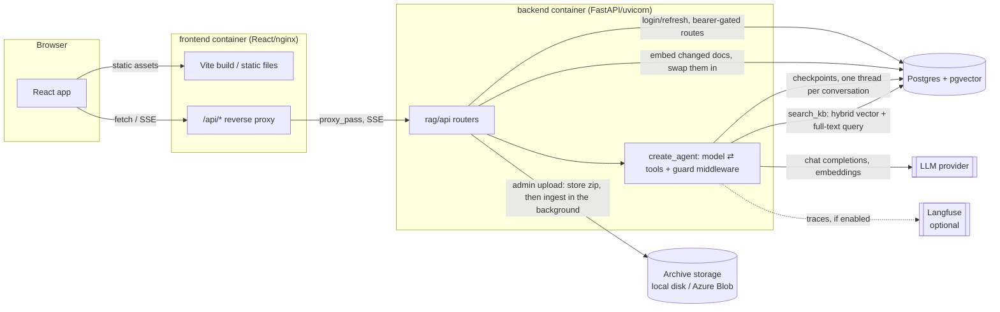
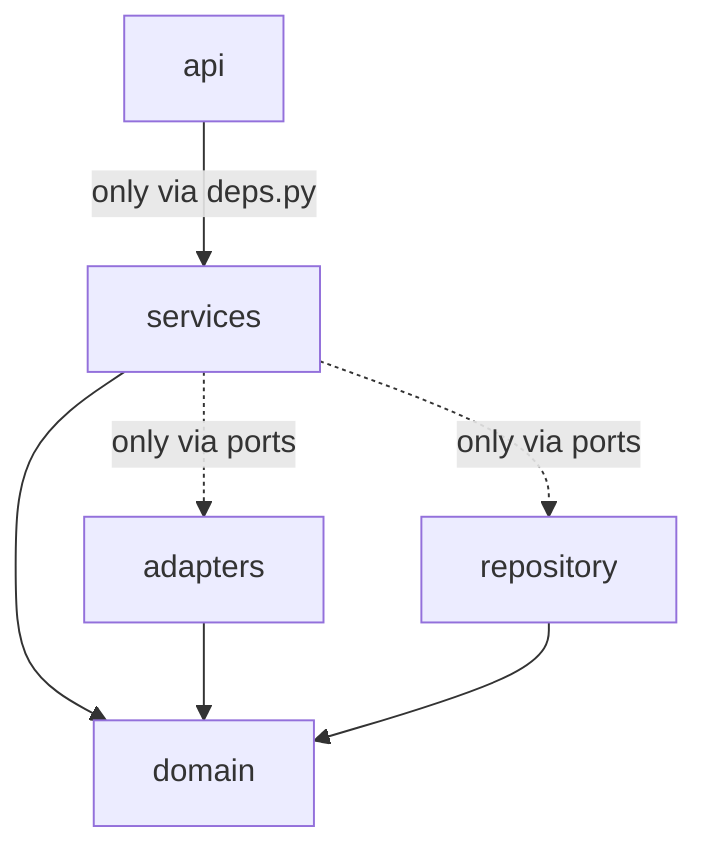
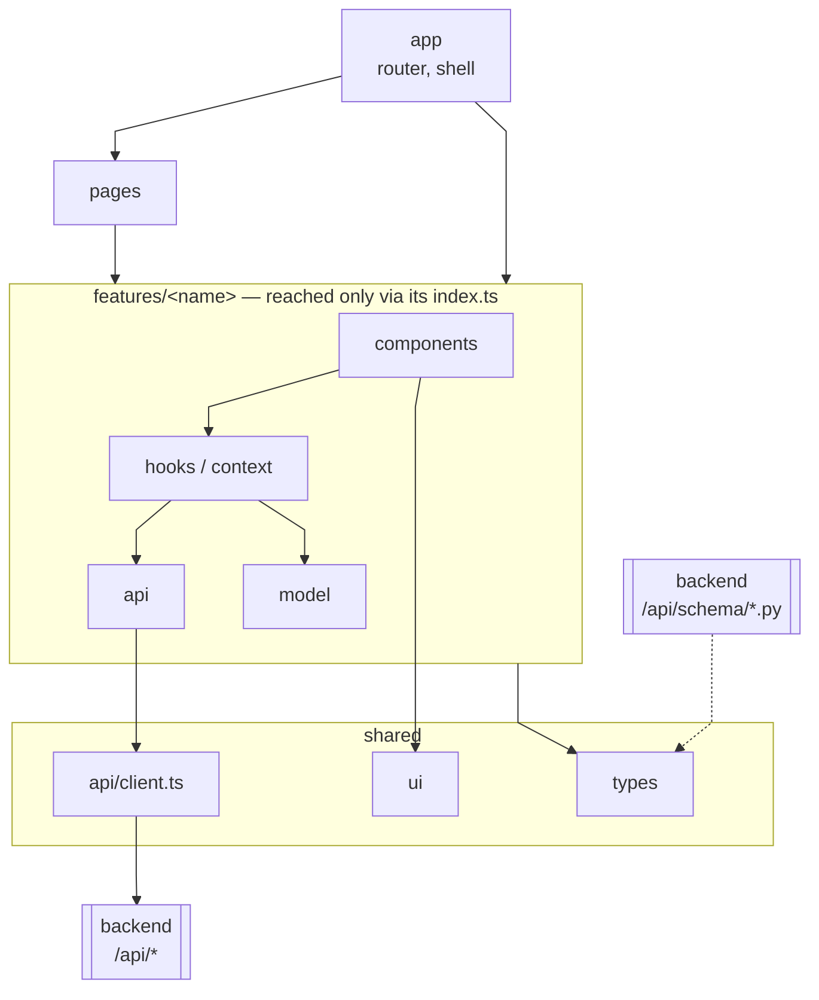
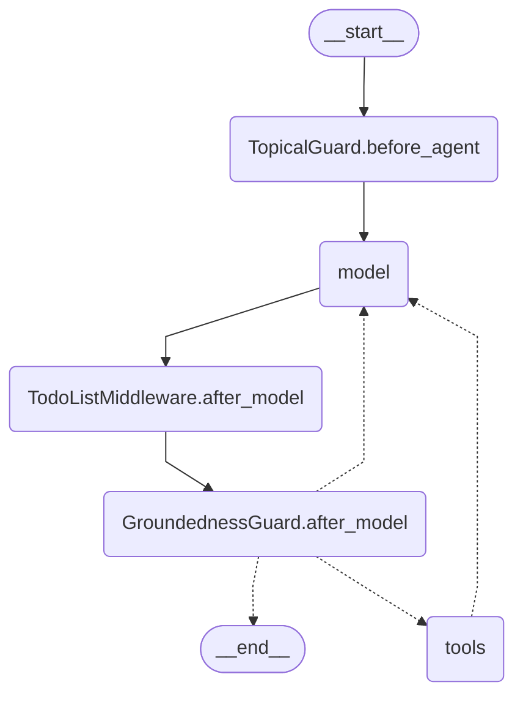

# Architecture

Diagram-first companion to [reference.md](reference.md) (what exists) and
[conventions.md](conventions.md) (how to extend it).

## System overview

```mermaid
graph LR
    subgraph browser[Browser]
        ui[React app]
    end

    subgraph frontendc["frontend container (React/nginx)"]
        static[Vite build / static files]
        proxy["/api/* reverse proxy"]
    end

    subgraph backendc["backend container (FastAPI/uvicorn)"]
        api[rag/api routers]
        langgraph["create_agent: model ⇄ tools + guard middleware"]
    end

    postgres[(Postgres + pgvector)]
    archives[(Archive storage<br/>local disk / Azure Blob)]
    llm[[LLM provider]]
    langfuse[[Langfuse<br/>optional]]

    ui -->|static assets| static
    ui -->|"fetch / SSE"| proxy
    proxy -->|"proxy_pass, SSE"| api
    api -->|"login/refresh, bearer-gated routes"| postgres
    api -->|"admin upload: store zip, then ingest in the background"| archives
    api -->|"embed changed docs, swap them in"| postgres
    api --> langgraph
    langgraph -->|checkpoints, one thread per conversation| postgres
    langgraph -->|search_kb: hybrid vector + full-text query| postgres
    langgraph -->|chat completions, embeddings| llm
    langgraph -.->|traces, if enabled| langfuse
```

The browser only ever sees one origin (e.g., `http://local:3000`) — it never knows the backend's hostname. nginx proxies
`/api/*` to `BACKEND_URL` (`infra/docker/nginx.conf.template`), and Vite's dev server proxies (`vite.config.ts`).

## Backend layering

```mermaid
graph TD
    api[api]
    services[services]
    domain[domain]
    adapters[adapters]
    repository[repository]

    api --> | only via deps.py | services
    services --> domain
    services -.->|only via ports| adapters
    services -.->|only via ports| repository
    adapters --> domain
    repository --> domain
```

* `domain` is pure.
* `services` and `api` never import `adapters`/`repository` directly — only via
`domain.ports`, wired in by `container.py`.
* `repository` sits alongside `adapters` under the
same rule.
* `adapters` and `repository` never import each other — they're independent implementations of
`domain.ports`, each wired in separately by `container.py`. Both depend on `domain` directly
(a `Protocol` to satisfy, models to construct), which is the one edge *into* `domain` this
diagram allows, since `domain` itself stays pure in the other direction.

## Frontend layering

The frontend is split by feature first (`src/features/<name>/`), then by layer inside each
feature. `app/` (router, shell) and `pages/` compose features; `shared/` is what every feature
builds on.

```mermaid
---
config:
  flowchart:
    curve: linear
---
graph TD
    app["app<br/>router, shell"]
    pages[pages]
    subgraph feature["features/&lt;name&gt; — reached only via its index.ts"]
        components[components]
        hooks[hooks / context]
        model[model]
        fapi[api]
    end
    subgraph shared[shared]
        ui[ui]
        client[api/client.ts]
        types[types]
    end
    backend[["backend<br/>/api/*"]]
    schema[["backend<br/>/api/schema/*.py"]]

    app --> pages
    app --> feature
    pages --> feature
    components --> hooks
    components --> ui
    hooks --> fapi
    hooks --> model
    fapi --> client
    client --> backend
    feature --> types
    schema -.-> types
```

Across features:
* A feature is used only through its public API, `@/features/<name>` (its `index.ts`) — never a
  file inside it, and never a relative path climbing out of it (`../../other-feature/…`).
* Features may use each other's public API (chat uses `conversations` and `knowledge-base`);
  `shared/` never imports a feature, page or the app.
* Only the lazily loaded `pages/ChatPage` imports `@/features/chat`, so the markdown renderer stays
  out of the main bundle.

Inside a feature (and `shared/`), the layers:
* `components` (and `pages`, `app`) never import an `api/` — they present, and reach the server
  through a hook or context.
* `hooks` and `context` never import `components`/`pages`/`shared/ui` — the logic layer doesn't
  depend on presentation.
* `api` only talks to the backend through `shared/api/client.ts`; it imports no hook, context,
  component or other feature.
* `model` is pure — no network, no framework state, no presentation.
* Server data lives in TanStack Query's cache (one `QueryClient`, created in `app/App.tsx`): a
  feature's hooks wrap `useQuery`/`useMutation` around its `api` calls, under the keys in its
  `api/queryKeys.ts`, and components only see what the hooks return. After a change the hooks
  patch the cache (`setQueryData`) rather than refetch, e.g. chat moving a conversation to the top
  of the sidebar list. The one context left, `AuthProvider`, holds the session, which isn't
  server data to cache; logging out clears the cache, so the next user can't see it.
* `shared/types` has two sources, not one: `rag/api/schema/*.py` (Pydantic models) generate it at
  build time — a different relationship than `api`'s runtime calls to `backend`, and
  one-directional (the schema is the source of truth; `api.generated.ts` is generated, never
  hand-edited). See [enforcement.md](enforcement.md#backendfrontend-schema-sync) for the full
  pipeline (`openapi-typescript` → `api.generated.ts` → `api.ts`) and what keeps it from drifting.

All enforced by oxlint; see [enforcement.md](enforcement.md#frontend-code-quality).

## Agent

`agent_service/graphs/tool_agent.py` builds the agent with LangChain's `create_agent`. The
graph below is the RAG agent's `graph.get_graph().draw_mermaid()`, as generated:

```mermaid
---
config:
  flowchart:
    curve: linear
---
graph TD;
	__start__([<p>__start__</p>]):::first
	model(model)
	tools(tools)
	TopicalGuard\2ebefore_agent(TopicalGuard.before_agent)
	GroundednessGuard\2eafter_model(GroundednessGuard.after_model)
	TodoListMiddleware\2eafter_model(TodoListMiddleware.after_model)
	__end__([<p>__end__</p>]):::last
	GroundednessGuard\2eafter_model -.-> __end__;
	GroundednessGuard\2eafter_model -.-> model;
	GroundednessGuard\2eafter_model -.-> tools;
	TodoListMiddleware\2eafter_model --> GroundednessGuard\2eafter_model;
	TopicalGuard\2ebefore_agent --> model;
	__start__ --> TopicalGuard\2ebefore_agent;
	model --> TodoListMiddleware\2eafter_model;
	tools -.-> model;

```

Nodes are the steps that change the graph's state:
- `TopicalGuard.before_agent` classifies the user's message once per turn.
- `TodoListMiddleware.after_model` rejects a reply that calls `write_todos` more than once.
- `GroundednessGuard.after_model` routes the turn: to `tools` for tool calls, back to `model`
  for an ungrounded answer under the revision cap, or to the end. `after_model` hooks run in
  reverse middleware order, so the first middleware's runs last.
- `tools` runs `search_kb`, `write_todos`, `save_user_preference` and `forget_user_preference`.

Middleware that only wraps each LLM call adds no node: `TopicalGuard` (off-topic instruction and
tool filter), `GroundednessGuard` (revision instruction), `CapabilityInstructions` (each capability's
instructions, e.g. the user's preferences), `TodoListMiddleware` (planning instructions) and `ModelRetryMiddleware` (retries).
The checkpointer saves the thread after each step; the preference tools and instructions read and
write preferences through `PreferenceService`.

See [services.md](services.md#generation-service) for what each middleware does and why.
