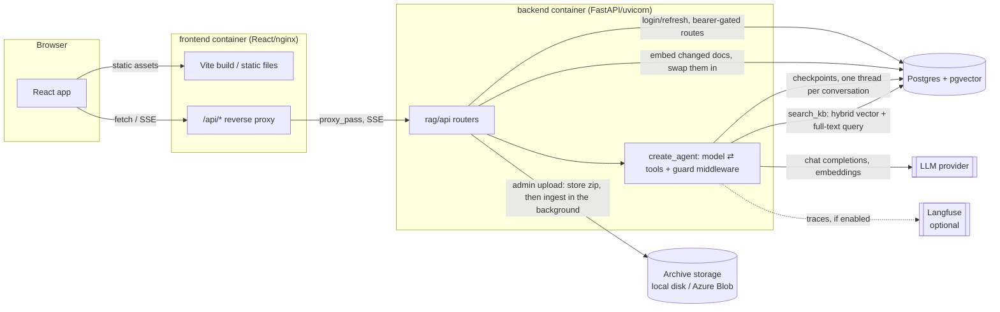
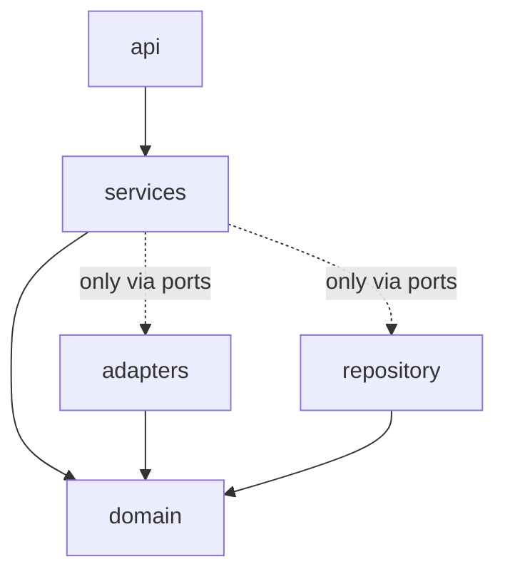
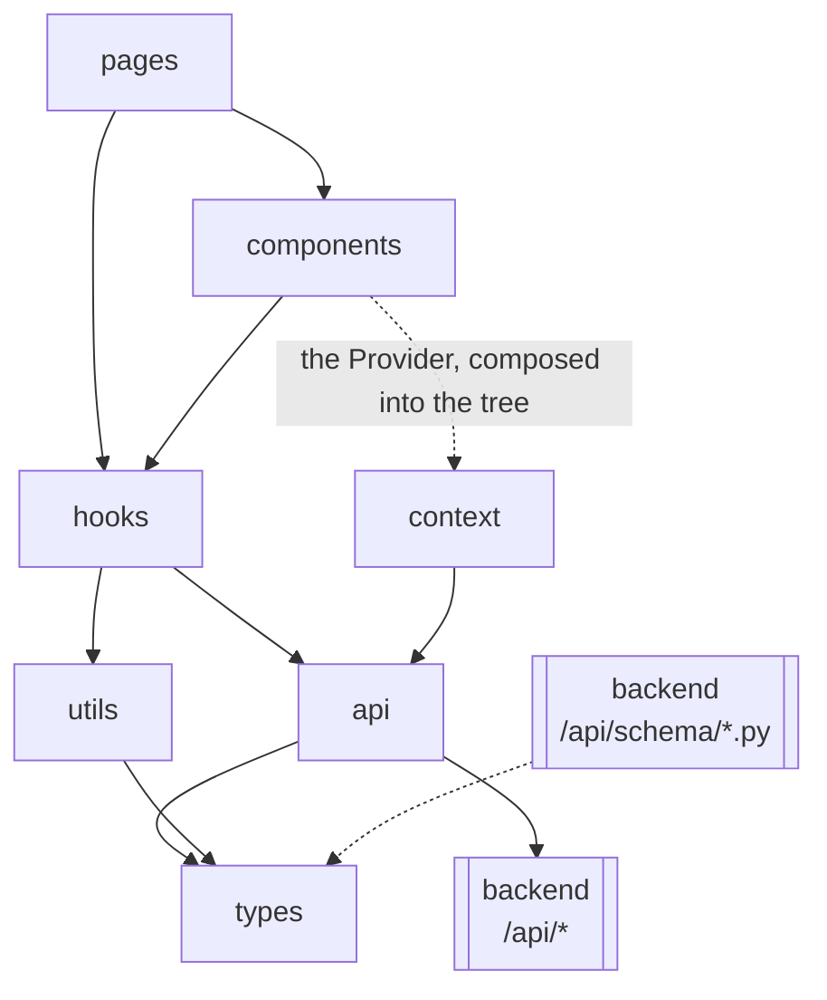
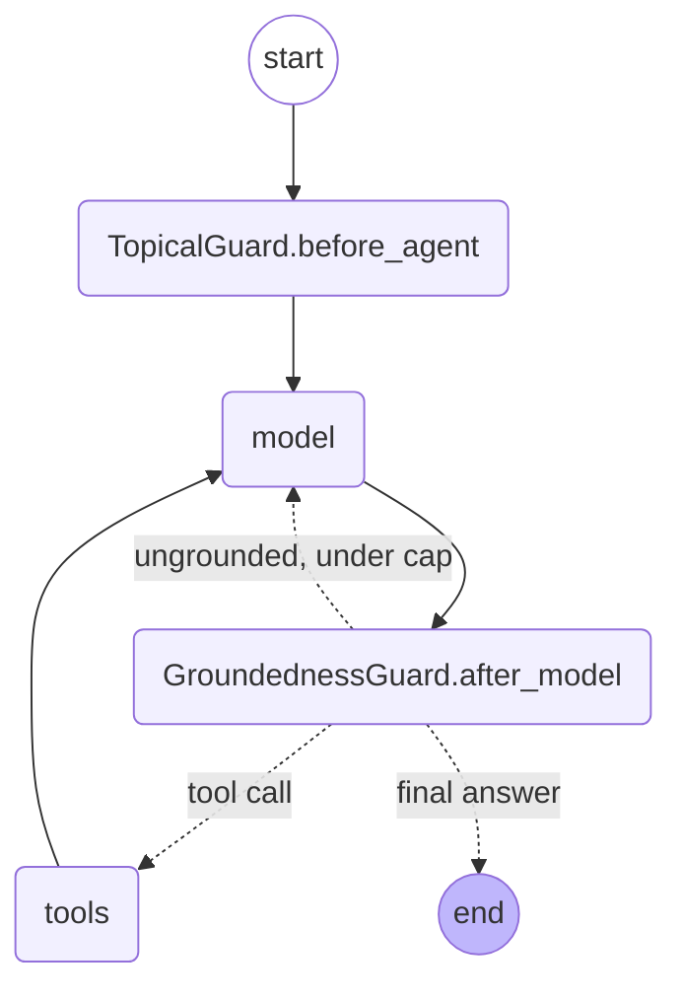

# Architecture

Diagram-first companion to [reference.md](reference.md) (what exists) and
[conventions.md](conventions.md) (how to extend it).

## System overview

```mermaid
graph LR
    subgraph browser[Browser]
        ui[React app]
    end

    subgraph frontendc["frontend container (React/nginx)"]
        static[Vite build / static files]
        proxy["/api/* reverse proxy"]
    end

    subgraph backendc["backend container (FastAPI/uvicorn)"]
        api[rag/api routers]
        langgraph["create_agent: model ⇄ tools + guard middleware"]
    end

    postgres[(Postgres + pgvector)]
    archives[(Archive storage<br/>local disk / Azure Blob)]
    llm[[LLM provider]]
    langfuse[[Langfuse<br/>optional]]

    ui -->|static assets| static
    ui -->|"fetch / SSE"| proxy
    proxy -->|"proxy_pass, SSE"| api
    api -->|"login/refresh, bearer-gated routes"| postgres
    api -->|"admin upload: store zip, then ingest in the background"| archives
    api -->|"embed changed docs, swap them in"| postgres
    api --> langgraph
    langgraph -->|checkpoints, one thread per conversation| postgres
    langgraph -->|search_kb: hybrid vector + full-text query| postgres
    langgraph -->|chat completions, embeddings| llm
    langgraph -.->|traces, if enabled| langfuse
```

The browser only ever sees one origin (e.g., `http://local:3000`) — it never knows the backend's hostname. nginx proxies
`/api/*` to `BACKEND_URL` (`infra/docker/nginx.conf.template`), and Vite's dev server proxies (`vite.config.ts`).

## Backend layering

```mermaid
graph TD
    api[api]
    services[services]
    domain[domain]
    adapters[adapters]
    repository[repository]

    api --> services
    services --> domain
    services -.->|only via ports| adapters
    services -.->|only via ports| repository
    adapters --> domain
    repository --> domain
```

* `domain` is pure.
* `services` and `api` never import `adapters`/`repository` directly — only via
`domain.ports`, wired in by `container.py`.
* `repository` sits alongside `adapters` under the
same rule.
* `adapters` and `repository` never import each other — they're independent implementations of
`domain.ports`, each wired in separately by `container.py`. Both depend on `domain` directly
(a `Protocol` to satisfy, models to construct), which is the one edge *into* `domain` this
diagram allows, since `domain` itself stays pure in the other direction.

## Frontend layering

```mermaid
graph TD
    pages[pages]
    components[components]
    hooks[hooks]
    context[context]
    api[api]
    types[types]
    utils[utils]
    backend[["backend<br/>/api/*"]]
    schema[["backend<br/>/api/schema/*.py"]]

    pages --> components
    pages --> hooks
    components --> hooks
    components -.->|the Provider, composed into the tree| context
    hooks --> api
    context --> api
    hooks --> utils
    api --> types
    utils --> types
    api --> backend
    schema -.-> types
```

* `components` and `pages` never import `api` — they present, and reach the server through a
  hook or context.
* `hooks` and `context` never import `components`/`pages` — the logic layer doesn't depend on
  presentation.
* `api` and `utils` are leaves on the frontend side: `api` only imports `types` (plus its own
  `client.ts`) and calls the backend's `rag/api` routers directly (see
  [System overview](#system-overview) for the network path — nginx proxying `/api/*` — between
  them); `utils` is pure — no network, no framework state.
* Hooks and context providers call `api` directly, and that's the intended shape: a hook is the
  data-access layer, the same role a `useQuery` hook plays elsewhere. Only two contexts exist
  (`AuthProvider`, `ConversationsProvider`) because only the session and the sidebar's
  conversation list are genuinely app-wide; everything else is local to the hook that owns it.
* `types` has two sources, not one: `rag/api/schema/*.py` (Pydantic models) generate it at build
  time — a different relationship than `api`'s runtime calls to `backend`, and one-directional
  (the schema is the source of truth; `types/api.ts` is generated, never hand-edited). See
  [enforcement.md](enforcement.md#backendfrontend-schema-sync) for the full pipeline
  (`openapi-typescript` → `api.generated.ts` → `api.ts`) and what keeps it from drifting.

All enforced by oxlint; see [enforcement.md](enforcement.md#frontend-code-quality).

## Agent

`generation_service/graph.py` builds the agent with LangChain's `create_agent`;

```mermaid
graph TD
    __start__((start)) --> topical(TopicalGuard.before_agent)
    topical --> model(model)
    model --> verify(GroundednessGuard.after_model)
    verify -.->|tool call| tools(tools)
    verify -.->|ungrounded, under cap| model
    verify -.->|final answer| __end__((end))
    tools --> model

    classDef default fill:#f2f0ff,line-height:1.2
    classDef first fill-opacity:0
    classDef last fill:#bfb6fc
    class __start__ first
    class __end__ last
```

See [services.md](services.md#generation-service) for what each middleware does and why.
