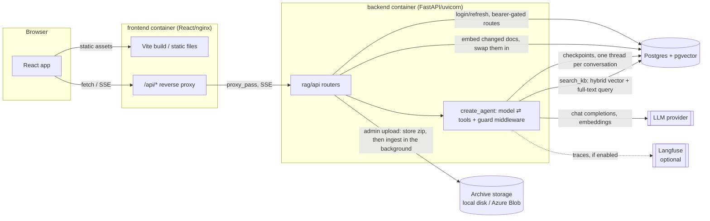
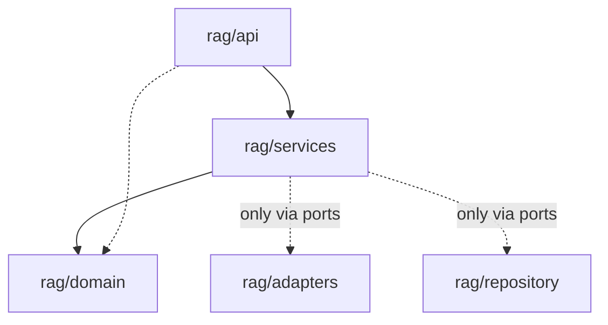
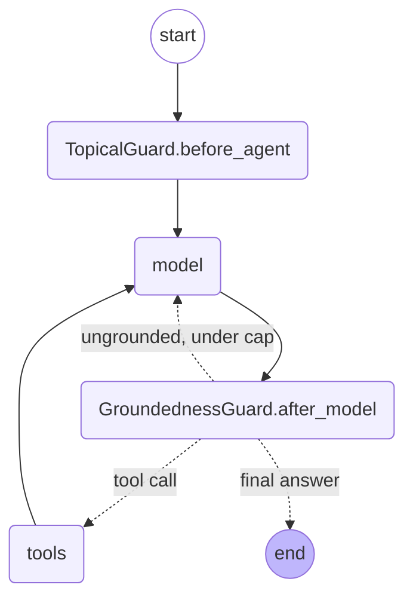
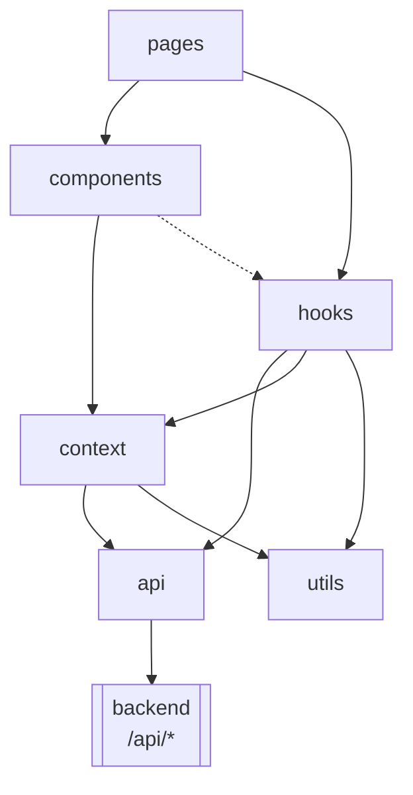

# Architecture

Diagram-first companion to [reference.md](reference.md) (what exists) and
[conventions.md](conventions.md) (how to extend it).

## System overview

```mermaid
graph LR
    subgraph browser[Browser]
        ui[React app]
    end

    subgraph frontendc["frontend container (React/nginx)"]
        static[Vite build / static files]
        proxy["/api/* reverse proxy"]
    end

    subgraph backendc["backend container (FastAPI/uvicorn)"]
        api[rag/api routers]
        langgraph["create_agent: model ⇄ tools + guard middleware"]
    end

    postgres[(Postgres + pgvector)]
    archives[(Archive storage<br/>local disk / Azure Blob)]
    llm[[LLM provider]]
    langfuse[[Langfuse<br/>optional]]

    ui -->|static assets| static
    ui -->|"fetch / SSE"| proxy
    proxy -->|"proxy_pass, SSE"| api
    api -->|"login/refresh, bearer-gated routes"| postgres
    api -->|"admin upload: store zip, then ingest in the background"| archives
    api -->|"embed changed docs, swap them in"| postgres
    api --> langgraph
    langgraph -->|checkpoints, one thread per conversation| postgres
    langgraph -->|search_kb: hybrid vector + full-text query| postgres
    langgraph -->|chat completions, embeddings| llm
    langgraph -.->|traces, if enabled| langfuse
```

The browser only ever sees one origin (e.g., `http://local:3000`) — it never knows the backend's hostname. nginx proxies
`/api/*` to `BACKEND_URL` (`infra/docker/nginx.conf.template`), and Vite's dev server proxies (`vite.config.ts`).

## Backend layering

```mermaid
graph TD
    api[rag/api]
    services[rag/services]
    domain[rag/domain]
    adapters[rag/adapters]
    repository[rag/repository]

    api --> services
    services --> domain
    api -.-> domain
    services -.->|only via ports| adapters
    services -.->|only via ports| repository
```

`domain` is pure. `services` and `api` never import `adapters`/`repository` directly — only via
`domain.ports`, wired in by `container.py`. `repository` sits alongside `adapters` under the
same rule. Enforced by `import-linter`, not just convention — see
[enforcement.md](enforcement.md#python-code-quality).

## Agent

`generation_service/graph.py` builds the agent with LangChain's `create_agent`;

```mermaid
graph TD
    __start__((start)) --> topical(TopicalGuard.before_agent)
    topical --> model(model)
    model --> verify(GroundednessGuard.after_model)
    verify -.->|tool call| tools(tools)
    verify -.->|ungrounded, under cap| model
    verify -.->|final answer| __end__((end))
    tools --> model

    classDef default fill:#f2f0ff,line-height:1.2
    classDef first fill-opacity:0
    classDef last fill:#bfb6fc
    class __start__ first
    class __end__ last
```

See [services.md](services.md#generation-service) for what each middleware does and why.

## Frontend structure

```mermaid
graph TD
    pages["pages"]
    context["context"]
    hooks["hooks"]
    utils["utils"]
    api["api"]
    components["components"]
    backend[["backend<br/>/api/*"]]

    pages --> components
    pages --> hooks
    components --> context
    components -.-> hooks
    hooks --> api
    hooks --> context
    hooks --> utils
    context --> api
    context --> utils
    api --> backend
```
