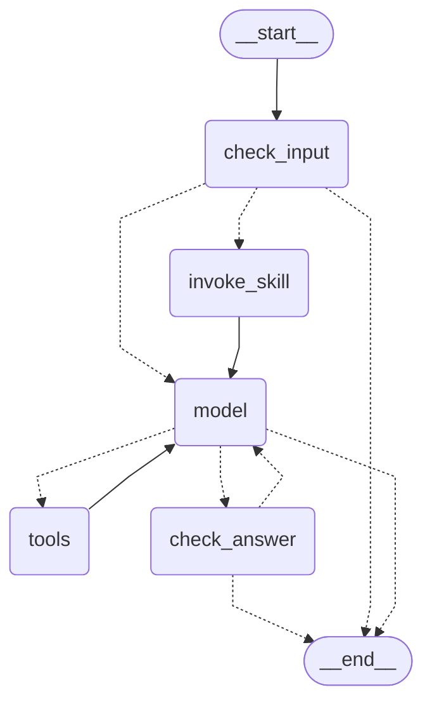

# Agent graph

Output of `graph.get_graph().draw_mermaid()` for the chat agent (`RagAgent.graph` in `rag/services/agent_service/agent.py`).

* `check_input` ends the turn for a blocked question and sends an off-topic one straight to `model`; `invoke_skill` starts a turn whose question begins with `/<name>` with that skill loaded; `check_answer` ends it, or sends a rejected answer back to `model` to revise.
* `model` builds each call's system prompt (planning or the off-topic decline) and picks its tools; neither is saved to the thread.
