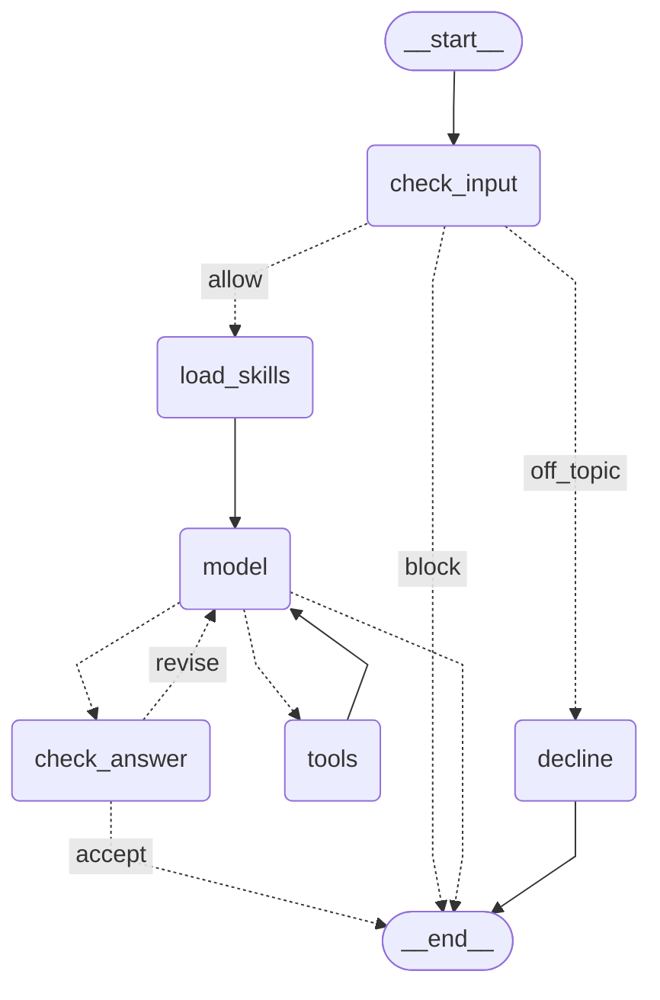

# Agent graph

Output of `graph.get_graph().draw_mermaid()` for the chat agent (`RagAgent.graph` in `rag/services/agent_service/agent.py`).

* `check_input` ends the turn for a blocked question, sends an off-topic one to `decline`, and the rest to `load_skills`; `load_skills` lists the user's skills for the model and starts a turn whose question begins with `/<name>` with that skill loaded; `check_answer` ends it, or sends a rejected answer back to `model` to revise.
* `model` builds each call's system prompt (planning and the user's skills) and binds the tools; `decline` answers an off-topic question with the decline prompt and no tools, and ends the turn. Neither prompt is saved to the thread.
