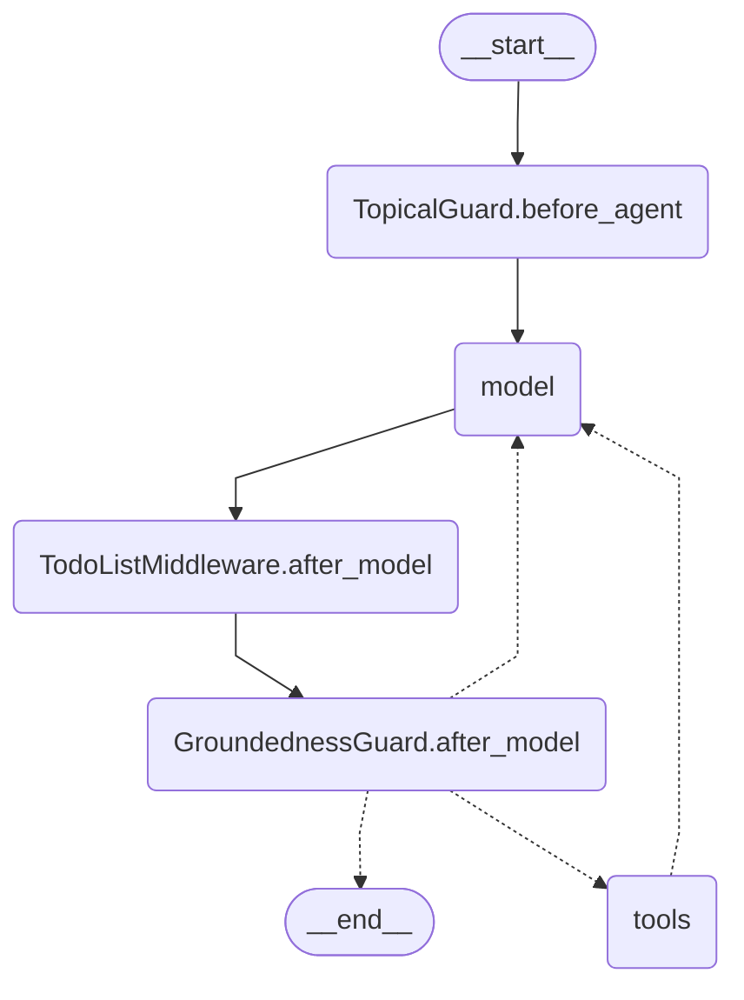

# Agent graph

Output of `graph.get_graph().draw_mermaid()` for the chat agent.

* `CapabilityInstructions` and `ModelRetryMiddleware` wrap each model call and add no node.
* `after_model` hooks run in reverse middleware order.
