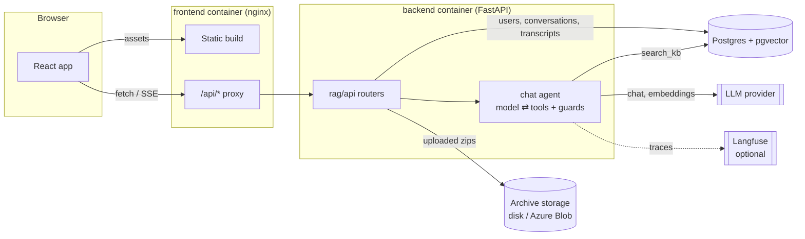
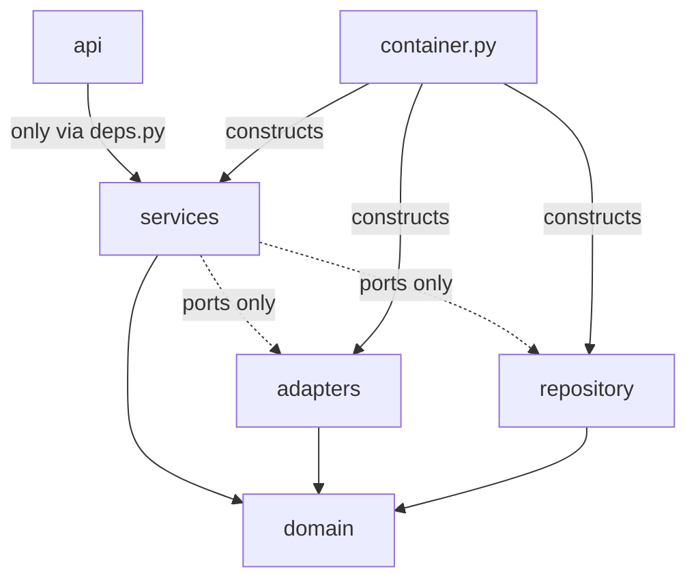
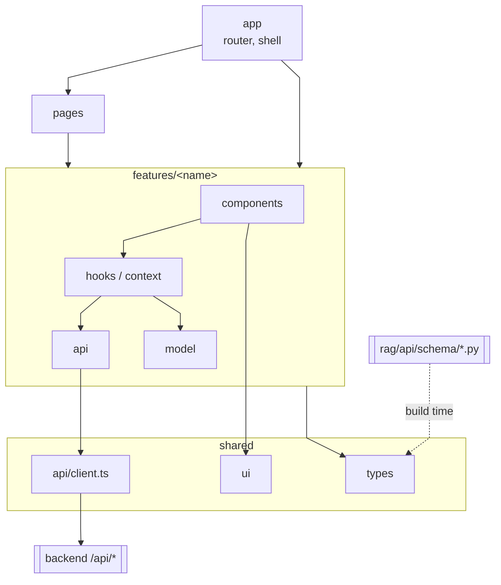

# Architecture

System overview, backend layers and frontend layers.

## System overview

## Backend layers

Arrows point to the imported layer. `import-linter` enforces every arrow.

## Frontend layers

oxlint enforces every arrow. Other features reach a feature only through its `index.ts`.

