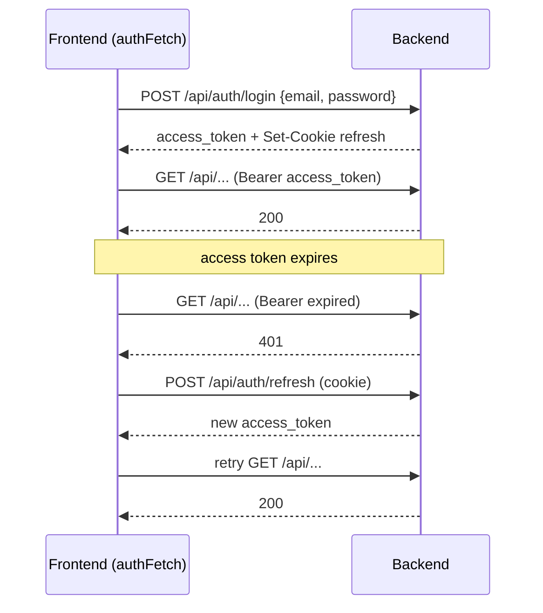

# Auth flow

```mermaid
sequenceDiagram
    participant UI as Frontend (authFetch)
    participant API as Backend

    UI->>API: POST /api/auth/login {email, password}
    API-->>UI: access_token + Set-Cookie refresh
    UI->>API: GET /api/... (Bearer access_token)
    API-->>UI: 200
    Note over UI,API: access token expires
    UI->>API: GET /api/... (Bearer expired)
    API-->>UI: 401
    UI->>API: POST /api/auth/refresh (cookie)
    API-->>UI: new access_token
    UI->>API: retry GET /api/...
    API-->>UI: 200
```
