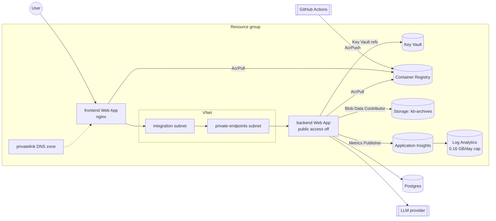

# Azure deployment

Provisioned by `infra/azure/main.bicep`. Postgres is not provisioned.

```mermaid
graph LR
    user((User))
    ci[[GitHub Actions]]

    subgraph rg[Resource group]
        subgraph vnet[VNet]
            integ[integration subnet]
            pe[private-endpoints subnet]
        end
        fe["frontend Web App<br/>nginx"]
        be["backend Web App<br/>public access off"]
        kv[(Key Vault)]
        acr[(Container Registry)]
        blob[(Storage: kb-archives)]
        dns[privatelink DNS zone]
        appi[(Application Insights)]
        logs[(Log Analytics<br/>0.16 GB/day cap)]
    end

    pg[(Postgres)]
    llm[[LLM provider]]

    user --> fe
    fe --> integ --> pe --> be
    dns -.-> fe
    be -->|Key Vault refs| kv
    be -->|Blob Data Contributor| blob
    be -->|Metrics Publisher| appi
    appi --> logs
    be --> pg
    be --> llm
    ci -->|AcrPush| acr
    fe -->|AcrPull| acr
    be -->|AcrPull| acr
```
