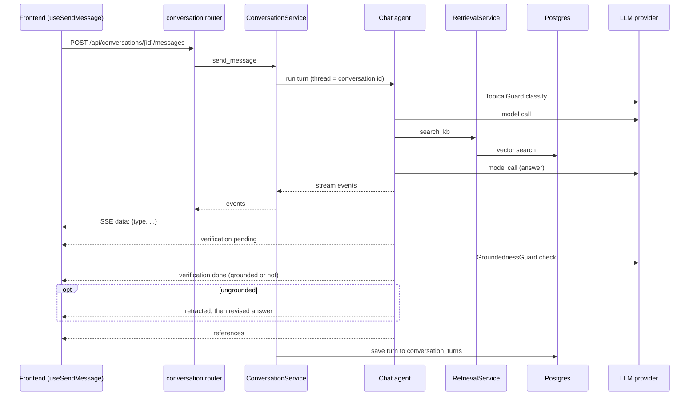

# Chat turn

```mermaid
sequenceDiagram
    participant UI as Frontend (useSendMessage)
    participant R as conversation router
    participant CS as ConversationService
    participant A as Chat agent
    participant KB as RetrievalService
    participant DB as Postgres
    participant LLM as LLM provider

    UI->>R: POST /api/conversations/{id}/messages
    R->>CS: send_message
    CS->>A: run turn (thread = conversation id)
    A->>LLM: TopicalGuard classify
    A->>LLM: model call
    A->>KB: search_kb
    KB->>DB: vector search
    A->>LLM: model call (answer)
    A-->>CS: stream events
    CS-->>R: events
    R-->>UI: SSE data: {type, ...}
    A-->>UI: verification pending
    A->>LLM: GroundednessGuard check
    A-->>UI: verification done (grounded or not)
    opt ungrounded
        A-->>UI: retracted, then revised answer
    end
    A-->>UI: references
    CS->>DB: save turn to conversation_turns
```
