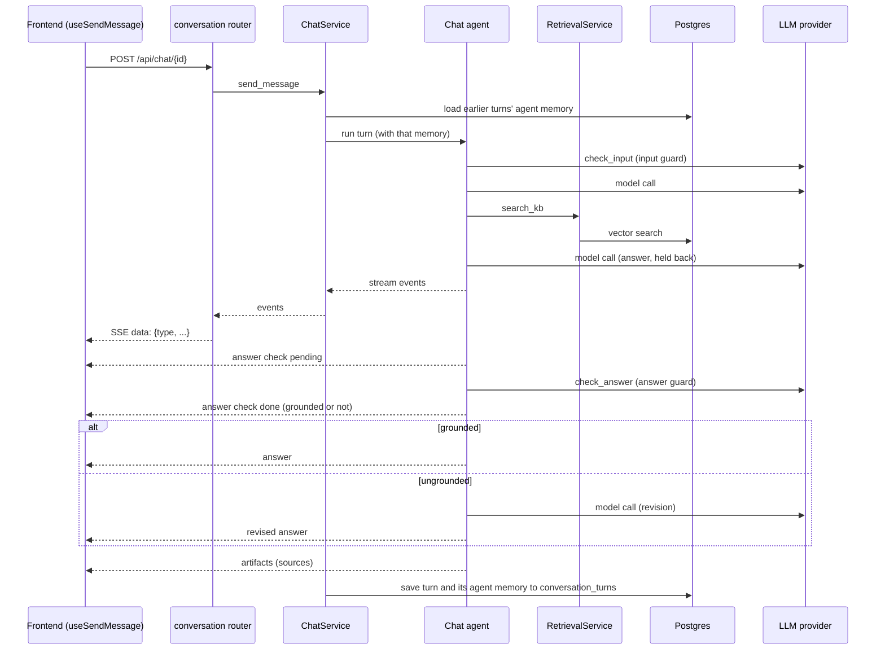

# Chat turn

```mermaid
sequenceDiagram
    participant UI as Frontend (useSendMessage)
    participant R as conversation router
    participant CS as ChatService
    participant A as Chat agent
    participant KB as RetrievalService
    participant DB as Postgres
    participant LLM as LLM provider

    UI->>R: POST /api/chat/{id}
    R->>CS: send_message
    CS->>DB: load earlier turns' agent memory
    CS->>A: run turn (with that memory)
    A->>LLM: check_input (input guard)
    A->>LLM: model call
    A->>KB: search_kb
    KB->>DB: vector search
    A->>LLM: model call (answer, held back)
    A-->>CS: stream events
    CS-->>R: events
    R-->>UI: SSE data: {type, ...}
    A-->>UI: answer check pending
    A->>LLM: check_answer (answer guard)
    A-->>UI: answer check done (grounded or not)
    alt grounded
        A-->>UI: answer
    else ungrounded
        A->>LLM: model call (revision)
        A-->>UI: revised answer
    end
    A-->>UI: artifacts (sources)
    CS->>DB: save turn and its agent memory to conversation_turns
```
