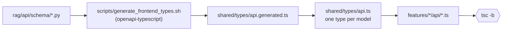

# Schema sync

Build-time link from backend schemas to frontend types.

```mermaid
graph LR
    schema["rag/api/schema/*.py"]
    gen["scripts/generate_frontend_types.sh<br/>(openapi-typescript)"]
    generated[shared/types/api.generated.ts]
    named["shared/types/api.ts<br/>one type per model"]
    feature["features/*/api/*.ts"]
    tsc{{tsc -b}}

    schema --> gen --> generated --> named --> feature
    feature --> tsc
```
