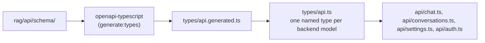

# Enforcement — What's Automatically Checked

Mechanisms that catch a problem automatically (pre-commit hook or CI), not conventions that
just rely on review discipline.

Generally, we prefer make the wrong thing fail to build instead of relying on review or discipline.

## Commit & branch hygiene
- Conventional Commits: `commitizen` (commit-msg stage) plus `cz check` on every pull request
  in CI (`pre-commit.yml`'s `commitizen` job)
- Gitflow, via `precommit-gitguard`: `no-direct-commit` (master/dev only accept merges),
  `no-direct-push`, `branch-name` (must follow `feat/fix/refactor/docs/chore/release/hotfix`),
  `stale-branch`

## Python code quality
- `ruff --fix` + `ruff-format` on every commit. Beyond the defaults, it turns convention rules
  into errors (`pyproject.toml`'s `[tool.ruff.lint]`):
  - banned APIs (`TID251`): `fastapi.HTTPException` (raise an `AppError` subclass instead) and
    `os.environ` / `os.getenv` (configuration comes through `rag.config.Settings`); tests may
    read the environment
  - `FAST`: FastAPI dependencies declared with `Annotated`, no redundant `response_model`
  - `T20`: no `print()` (the CLI uses `typer.echo`); scripts that write to stdout are exempt
  - `C901` with a max complexity of 5, plus `B`, `SIM`, `RET`, `UP`, `ERA`, `PTH`, `ASYNC`, …
- `pyright` on every commit (pre-commit stage, so CI runs it too): **strict** for
  `rag/domain`, `rag/api`, `rag/repository`, `rag/adapters` and the top-level modules, basic for
  `rag/services`, where LangChain's partly untyped API leaks in
- `import-linter` (`lint-imports`) enforces the architecture in `rag/`
  (`pyproject.toml`'s `[tool.importlinter]`, with `include_external_packages = true` so
  contracts can also forbid third-party packages, not just `rag.*`):
  - `rag.domain` may not import `rag.services`, `rag.adapters`, `rag.repository`, `rag.api`, or
    LangChain/LangGraph (`langchain_core`, `langchain`, `langgraph`) — "domain is pure" in both
    senses: no other layer, and no framework
  - `rag.services` may not import `rag.adapters`, `rag.repository`, the entrypoints, or `rag.api`
  - `rag.repository` may not import `rag.services`, `rag.adapters`, `rag.api`, or the entrypoints
    — it reaches only the domain (plus whatever DB/SDK client its own file needs)
  - only the composition root (`container.py`) constructs adapters or repositories
  - `rag.api` may not import the entrypoints (`app.py`, `cli.py`)
  - within `rag.api`, only `deps.py` reaches `rag.services` and the container; routers get
    services through its `Annotated` aliases
  - routers may not import `rag.domain` or `rag.config` directly; only `deps.py` and
    `rag.api.schema` translate domain types into the API layer (`AuthenticatedUserDep`'s
    `AuthenticatedIdentity`, owned by `auth_service` rather than `rag.domain.models` since
    nothing else uses it; `to_stream_event`)
  - routers are independent of each other
  - services are independent of each other, with no exceptions: one that needs another depends
    on a port in `rag.domain.ports` (`GenerationPort`, `SearchPort`), and `container.py` wires in
    the implementation (Clean Architecture's "use cases don't call use cases")
  - an explicit layering contract: `rag.api` → `rag.services` → `rag.domain`
- `uv-lock` keeps `uv.lock` in sync with `pyproject.toml`, auto-fixing locally

## Frontend code quality
- `frontend-lint` runs oxlint (`frontend/.oxlintrc.json`) on every commit with
  `--deny-warnings`, so CI's `pre-commit` job gates on it. Besides the React hooks rules, it
  enforces the frontend's layering end to end (`no-restricted-imports`, scoped per directory via
  `overrides`):
  - components and pages never import `api/`: they only present, and reach the server through
    a hook or context
  - hooks and context never import `components/` or `pages/` — the logic layer doesn't depend on
    presentation (guards against the backward-dependency direction: nothing stops a hook from
    importing a component otherwise)
  - `api/` never imports `hooks/`, `context/`, `components/`, or `pages/` — it only talks to the
    backend (`client.ts` + `types/`), so it stays usable from anywhere
  - `utils/` never imports `api/`, `hooks/`, `context/`, `components/`, or `pages/` — pure
    helpers, no network, no framework state, no presentation
  - types come from the `types` index, never a single file inside `types/`; only
    `types/api.ts` imports the generated `api.generated.ts`
  - no bare `fetch` outside `api/client.ts` and `api/auth.ts`, so every call goes through the
    client that adds the token and refreshes it (`no-restricted-globals`)
  - hooks and context providers routinely call `api/` directly (e.g. `useChat`, `useSettings`,
    `AuthProvider`) — that's the intended shape, not a gap: a hook/provider *is* the data-access
    layer, the same role a `useQuery` hook plays in TanStack Query. Only two contexts exist
    (`AuthProvider`, `ConversationsProvider`) because only session and the sidebar's conversation
    list are genuinely app-wide state; everything else is correctly local to the hook that owns
    it. `AuthProvider` importing `AuthContext` *from* `hooks/useAuth.ts` (not the other way
    round) is deliberate too: it keeps the Context object (non-component export) out of the
    Provider's file, which is what `react/only-export-components` is already guarding against
    (mixing component and non-component exports breaks React Fast Refresh)
- `tsc` runs strict (the TypeScript 6 default) plus `noUncheckedIndexedAccess`, so `list[i]` is
  `T | undefined` and has to be checked (`frontend-typecheck`, below)

## Backend/frontend schema sync

A build-time connection, not a runtime one:

- The `frontend-api-types` pre-commit hook regenerates
  `frontend/src/types/api.generated.ts` from the backend's OpenAPI schema whenever
  `rag/api/schema/*.py` or `rag/api/routers/*.py` change (`scripts/generate_frontend_types.sh`) —
  auto-fixes locally like `uv-lock`, and re-runs in CI so a stale generated file fails the
  `pre-commit` job
- `frontend/src/types/api.ts` is the one place backend shapes enter the frontend: one named
  type per model in `rag/api/schema/`, same name, grouped by module (`ConversationResponse`,
  `ToolEvent`, …); the generated `components` map isn't exported, so nothing else can reach
  around it. A backend model renamed or removed breaks its line there (`tsc`, via the
  `frontend-typecheck` pre-commit hook); a new one needs its line added before the frontend can
  use it — the one manual step, and it can't drift silently
- `frontend-typecheck` (pre-commit, and CI's `pre-commit` job) runs `tsc -b` over the frontend,
  so code that no longer matches the regenerated types fails instead of breaking at runtime;
  `createBubbleHandler`'s `satisfies never` default makes a new stream event type one of those
  failures (the stream union is a named root model, `StreamEventResponse`, so it's generated too)

## Tests
- `pytest tests/unit` runs on every commit (pre-commit hook) and again in CI
  (`pre-commit.yml`'s `test` job)
- Architecture tests among them check what no linter can:
  `test_every_route_requires_a_signed_in_user_unless_public` walks every route (router-level
  dependencies included) and fails if one outside a short public allowlist (login, refresh,
  logout, health) doesn't depend on `get_current_user`, so a new route or router can't ship
  unauthenticated; the allowlist can't go stale either, since a public route that became
  protected fails it too
- `pytest tests/integration` only runs on manual `workflow_dispatch`
  (`integration-tests.yml`) — **not** a merge gate. That job starts a throwaway Postgres, runs
  `alembic upgrade head`, then `downgrade base` and `upgrade head` again (so every migration
  must also undo cleanly), and fails — rather than skips — when a required setting is missing,
  so it can't pass green with zero tests run

## Database
- Migrations are append-only: the `migrations-append-only` pre-commit hook fails if a staged
  change modifies, renames or deletes a committed migration, and a pull-request step in CI
  (`pre-commit.yml`'s `commitizen` job) runs the same check against the PR's base
  (`scripts/check_migrations_append_only.sh`). A deliberate exception, such as squashing
  before 1.0, goes through `SKIP=migrations-append-only`
- Postgres itself refuses rows that break a table's rules (migration `0007`): emails are
  lowercase (so they're unique regardless of case), a conversation title is never blank, a
  content hash is a SHA-256, chunk indexes aren't negative, and an ingestion run has exactly
  the fields its status allows; partial unique indexes allow one running ingestion and one
  empty conversation per user
- LangGraph's checkpoint tables live in their own `langgraph` schema (migration `0008`; the
  checkpointer connects with `search_path=langgraph`), so `public` holds only tables Alembic
  owns

## General file hygiene
`trailing-whitespace`, `end-of-file-fixer`, `check-yaml`, `check-added-large-files`
(max 1000kb), `check-merge-conflict`, `debug-statements` — standard `pre-commit-hooks`

## What CI actually gates on PR / push to master
`pre-commit.yml` runs three jobs: the full pre-commit suite (ruff, pyright, import-linter, unit
tests, the frontend type sync, type check and lint, …), `pytest tests/unit`, and (PR only) the
Conventional Commits check across the PR's commit range.
