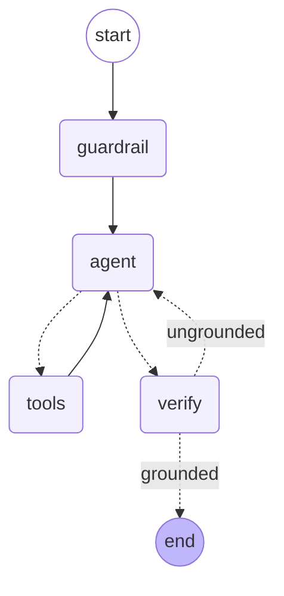

# Engineering Design — RAG Chatbot

A retrieval-augmented chatbot over a static markdown knowledge base (the repo's `data/` — gitignored,
you provide your own `.md` files; see [docs/setup.md](setup.md)), with a FastAPI backend and a
separate React frontend.



`guardrail` classifies the message as in/out of scope for AtlasFlow (adding an off-topic
instruction rather than short-circuiting, so the decline text is still generated — and
streamed — by `agent`). `agent` calls the LLM (bound to `search_kb`); `tools_condition` routes
to `tools` on a tool call or on to `verify` otherwise. `tools` always loops back to `agent`.
`verify` checks the final answer against retrieved context (`is_grounded`) and either ends the
turn or sends `agent` back with a revision instruction, capped at `MAX_VERIFY_ATTEMPTS`.

## Tech stack

| Concern | Choice |
|---|---|
| Language | Python ≥3.12, managed with `uv` |
| Backend framework | FastAPI, LangGraph |
| Frontend | React 19 + TypeScript + Vite, Tailwind CSS, `@chatui/core` |
| Retrieval | Hybrid search via the `pinecone` SDK's async client directly — Pinecone hosts the embedding models |
| Observability | `logging` (default) or `langfuse` |
| Local dev | Docker Compose — `backend` (FastAPI/uvicorn), `frontend` (nginx serving the Vite build, proxying `/api/*`), `postgres` (checkpointer storage) |
| Prod deployment | Azure App Service for Containers; secrets via Azure Key Vault references (see [Secrets management](#secrets-management)) |
| Quality gates | `ruff` (incl. `PTH`), `pre-commit`, `import-linter`, `commitizen` |

## Layout

```
rag/
├── __init__.py / __main__.py         # `python -m rag` entrypoint
├── cli.py                            # Typer: `rag serve`, `rag ingest`
├── config.py                         # Settings (pydantic-settings)
├── container.py                      # composition root — async context manager, builds Container
├── app.py                            # FastAPI-specific only: lifespan, routers
│
├── domain/                           # zero framework imports — pure contracts + models
│   ├── models.py                     # RawDocument, IngestionReport
│   └── ports.py                      # VectorStorePort, DocumentLoaderPort, ChunkerPort
│
├── services/                         # business logic — depends only on domain/ports
│   ├── retrieval_service/            # hybrid similarity search + single-doc lookup
│   ├── ingestion_service/            # + loaders.py, chunking.py
│   └── generation_service/           # + graph.py, service.py, tools.py, streaming.py, guards/
│
├── adapters/                         # concrete SDK clients — the only importers of 3rd-party SDKs
│   ├── pinecone_client.py            # hybrid dense+sparse HybridPineconeVectorStore
│   ├── llm_client.py
│   ├── checkpointer.py               # LangGraph checkpointer (CHECKPOINTER_BACKEND)
│   └── observability.py              # Langfuse tracing config
│
├── api/
│   ├── schema.py                     # request/response DTOs
│   └── routers/                      # chat.py, health.py, kb.py, settings.py
│
frontend/                              # repo root — separate Vite/React app
├── src/
│   ├── api/                          # chat.ts (SSE client), settings.ts
│   ├── components/                   # ToolBubble, SourcesBubble, MessageContent, layout/
│   ├── hooks/useChat.ts
│   └── pages/                        # ChatPage, SettingsPage, NotFoundPage
└── (Vite build served by nginx in Docker)

infra/                                 # repo root — Docker + Azure infra, no Python imports
├── docker/                            # Dockerfile.backend, Dockerfile.frontend, nginx.conf.template
└── azure/                             # main.bicep — see docs/infra.md
```


## Services

Three services, each with a narrow, ports-typed constructor. There is no separate embedding
service — Pinecone's integrated inference embeds text server-side, so nothing in `rag/` ever
calls an embedding model directly.

| Service | Responsibility | Depends on |
|---|---|---|
| `retrieval_service` | hybrid (dense+sparse) similarity search, plus single-document lookup by `source_id` | `VectorStorePort` |
| `ingestion_service` | load → chunk → upsert, source-agnostic (upsert triggers Pinecone-side embedding) | `DocumentLoaderPort`, `ChunkerPort`, `VectorStorePort` |
| `generation_service` | owns the LangGraph graph: guardrail → agent → tools → verify, tool calls, streaming, tracing | `BaseChatModel`, `retrieval_service`, checkpointer |


## Dependency injection

`container.py` is the only place concrete adapters get constructed and injected — pure wiring, no
FastAPI/React imports. It's an async context manager so the Pinecone index connections it opens
get torn down deterministically:

```python
@dataclass
class Container:
    ranking_service: RetrievalService
    generation_service: GenerationService
    ingestion_service: IngestionService


@asynccontextmanager
async def build_container(settings: Settings) -> AsyncGenerator[Container]: ...
```


## Conversation state

A LangGraph checkpointer, keyed by a client-generated UUID `thread_id`, built by
`adapters/checkpointer.py`'s `open_checkpointer()` (an async context manager, mirroring
`open_vector_store()`) from `Settings.CHECKPOINTER_BACKEND`:
- The frontend generates one per browser session and passes it in every request.
- A raw API caller generates and passes its own in `ChatRequest.thread_id`.
- The server never reconstructs history from a request payload — the checkpointer loads/saves it.
- `"memory"` (default) → `InMemorySaver`, for local dev; doesn't survive a restart or multiple
  replicas.
- `"postgres"` → `AsyncPostgresSaver`, reading `Settings.DATABASE_URL`; `checkpointer.setup()`
  runs on connect (idempotent schema migration). Durable across restarts and safe for multiple
  backend replicas.

## Tool calling

`generation_service`'s `search_kb` tool is built as a closure inside `tools.py`
(`build_search_tool(ranking_service)`), not a module-level `@tool` function — this keeps it
consistent with constructor injection everywhere else, since `retrieval_service` is a fixed
dependency of the service instance, not something that varies per request. (The parameter is
still named `ranking_service` in code — a naming holdover from before the `ranking_service` →
`retrieval_service` rename that hasn't been swept through every call site yet.)

## Observability

`adapters/observability.py` exposes `open_trace_config(settings)`, an async context manager
(opened in `container.py` alongside the vector store and checkpointer) that yields a
`trace_config(name)` callable returning a LangChain `RunnableConfig` with the backend's callback
wired in — so callers always pass `config=trace_config(...)` with no behavioral branching.
`GenerationService` uses it to tag the chat run. The backend is picked by
`Settings.OBSERVABILITY_BACKEND`:

- `"logging"` (default) — `_LoggingCallbackHandler` logs LLM/tool start/end events through the
  standard `logging` module; zero extra infra.
- `"langfuse"` — a single Langfuse `CallbackHandler`, requiring `LANGFUSE_PUBLIC_KEY` /
  `LANGFUSE_SECRET_KEY` / `LANGFUSE_HOST` (validated in `config.py`). On teardown, the context
  manager's `finally` calls `get_client().flush()` so short-lived runs aren't lost.

## Streaming

`generation_service/streaming.py` normalizes LangGraph's `astream_events` into one small event
vocabulary (`TextDelta`, `ToolCallStart`, `ToolCallResult`), filtered to the `agent` node's chat
model calls only — `guardrail` and `verify` run their own LLM calls (classification, not an
answer) through the same graph, and `astream_events` would otherwise leak those tokens into the
text stream too. Two consumers read the normalized stream:
- FastAPI's `POST /api/chat/stream` turns it into SSE (`text` / `tool_start` / `tool_result`
  events).
- The React frontend consumes that SSE stream with `@microsoft/fetch-event-source`
  (`api/chat.ts`), rendering tool calls via `ToolBubble` and citations via `SourcesBubble`
  (which links to `/api/kb/{filename}`).

## Ingestion — designed for more sources later

```python
class DocumentLoaderPort(Protocol):
    def load(self) -> Iterable[RawDocument]: ...


class ChunkerPort(Protocol):
    def chunk(self, document: RawDocument) -> list[Document]: ...
```

`MarkdownFileLoader` is the only concrete loader today. Adding a new source (PDF, Confluence, a
wiki) means writing a new class satisfying `DocumentLoaderPort` and registering it —
`IngestionService`, chunking, and the vector store adapter are all untouched. Two chunkers exist:
`WholeDocumentChunker` (one chunk per document — wired in by default in `container.py`) and
`MarkdownHeaderChunker` (splits on `#`/`##`/`###` headings). Both produce `langchain_core.Document`
chunks directly, with deterministic ids (`f"{source_id}::{chunk_index}"`), so re-running
`rag ingest` after a doc changes upserts over the existing vectors instead of duplicating them.
`IngestionService` never calls an embedding model itself — `aadd_documents` upserts raw
text+metadata records to both the dense and sparse Pinecone indexes, and Pinecone's integrated
inference embeds them server-side. Both indexes are created idempotently (check-exists /
create-if-missing, one per configured embedding model) on first `rag ingest` run — no manual
console step required.

## Secrets management

**Local dev** — all secrets live in `.env` (gitignored, never committed), loaded by
`pydantic-settings`. The one exception is the `postgres` container's own init password: it's
passed via a Docker Compose secret file (`.secrets/postgres_password.txt`, also gitignored,
referenced in `docker-compose.yml`'s `secrets:` block) rather than an env var, so it never has to
round-trip through `Settings` at all — the app connects to Postgres using `DATABASE_URL` (which
already contains the same password), not `POSTGRES_PASSWORD`.

**Prod (Azure App Service)** — secrets are stored in Azure Key Vault and exposed to the app as
*Key Vault references* in App Service's Application Settings. App Service resolves these (via the
app's system-assigned Managed Identity — no credentials stored anywhere) into plain env vars
before the container starts, so `Settings` needs no code changes: it already reads config from
`os.environ` via `pydantic-settings`. Registry access (`AcrPull`/`AcrPush`) follows the same
no-stored-credentials pattern.

This whole setup — Key Vault, RBAC role assignments, App Service, Container Registry, and the VNet
+ Private Endpoint that keep the backend off the public internet (see [docs/infra.md](infra.md#infraazure))
— is codified in [infra/azure/main.bicep](../infra/azure/main.bicep); see
[docs/infra.md](infra.md) for how to validate, preview, and deploy it. Provision/update by
running that template, not by hand.

Known limitation: App Service caches resolved Key Vault references and refreshes them
periodically (not instantly), so rotating a secret's value in the Vault requires restarting the
app to pick it up immediately.

## API surface

- `POST /api/chat/stream` — `{message: str, thread_id: str}` → SSE stream of normalized events.
- `GET /api/health/live` — always 200 (liveness probe).
- `GET /api/health/ready` — deliberately exercises the real retrieval path (a dense+sparse
  Pinecone query) rather than a bare ping, so "ready" actually means "can serve"; no real LLM
  call.
- `GET /api/kb/{filename}` — returns the reassembled document as `text/plain`, or 404. Used by
  the frontend's source citations.
- `GET /api/settings` — returns `{model, temperature, top_k, system_prompt}` for display in the
  UI. `temperature` and `top_k` are currently static constants in the router, not yet threaded
  through the actual generation/retrieval calls they name.
